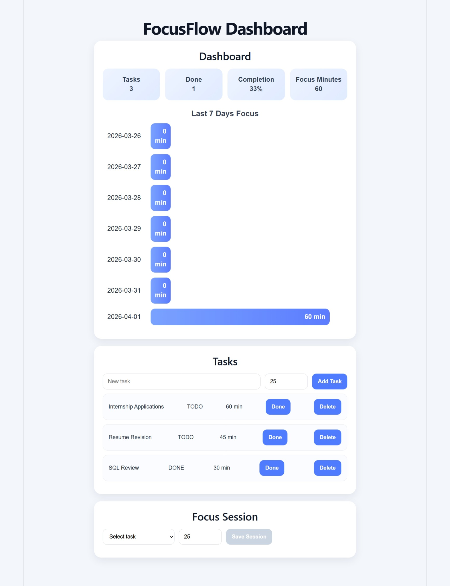
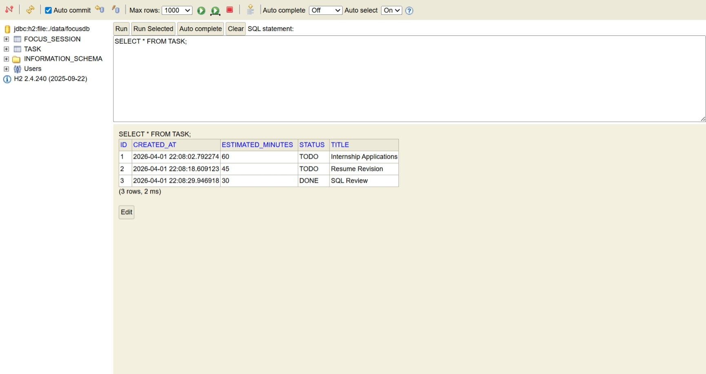

# FocusFlow Productivity Dashboard

A full-stack productivity dashboard for managing tasks, recording focus sessions, and visualizing weekly focus trends.

## Screenshots

### Dashboard Overview

### H2 Database View

## Project Overview

This project was built as a full-stack dashboard application for tracking productivity-related workflows.

The application allows users to:

- create and manage tasks
- mark tasks as completed
- record focus-session minutes
- view dashboard metrics
- visualize focus trends across the last 7 days

## Tech Stack

- Java
- Spring Boot
- React
- H2 Database
- Spring Data JPA
- REST APIs

## Features

- task CRUD workflows
- focus-session recording
- dashboard summary metrics
- 7-day focus trend visualization
- REST API integration between frontend and backend
- H2-backed local data persistence

## My Contribution

I built a full-stack productivity dashboard with a Spring Boot backend and a React frontend.

My work included:

- developing REST APIs for task management, focus-session tracking, and dashboard analytics
- building the React dashboard UI for tasks, focus sessions, and metrics display
- integrating frontend workflows with backend API endpoints
- using Spring Data JPA with H2 to persist task and focus-session data

## Files / Structure

- `backend` — Spring Boot backend, REST APIs, and H2 persistence
- `frontend` — React frontend dashboard
- `docs/screenshots` — README images

## Run

Backend:

`./mvnw spring-boot:run`

or

`mvn spring-boot:run`

Frontend:

`npm install`

`npm start`

## Notes

This repository uses local demo data for development.